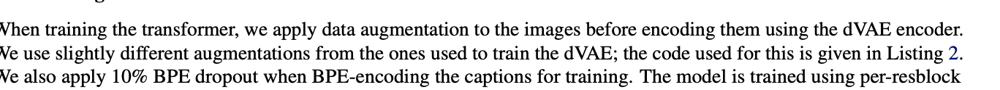
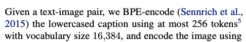
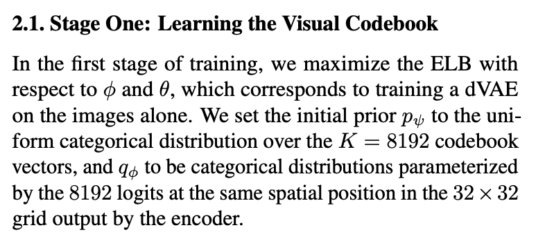
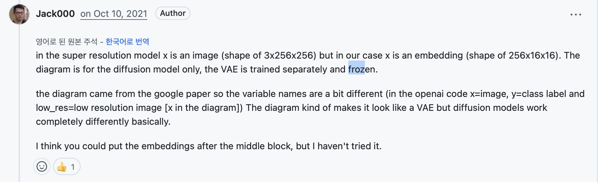
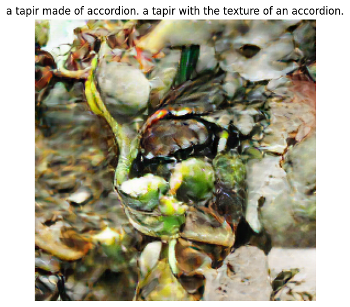
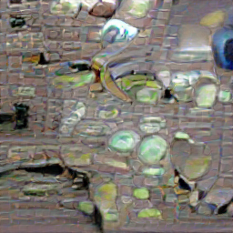
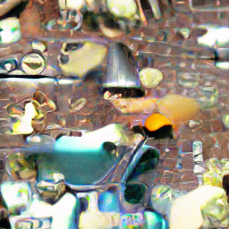
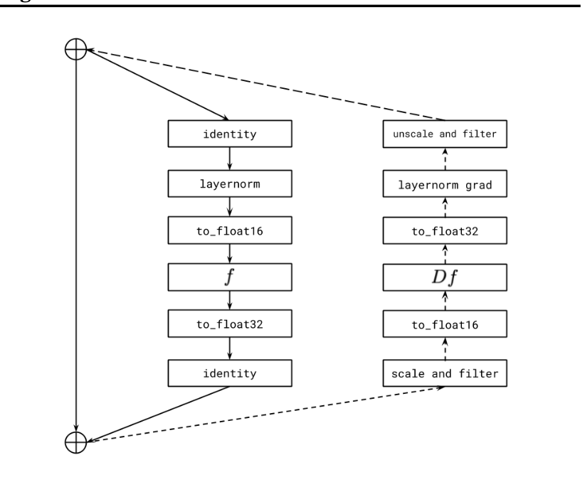

# Dalle_prototype

해당 구현은 크게 3가지로 나눌수있다

BPE

VAE 

TRANSFORM

### 1. BPE



```python
class CocoTextPairDataset(Dataset):
    
    
    def __init__(self, folder, tokenizer=None, transform=None, text_seq_len=128, dropout_prob=0.1):#논문에서의 bpe 10% drop 재현
        self.folder = folder
        self.tokenizer = tokenizer
        self.text_seq_len = text_seq_len
        self.transform = transform
        self.dropout_prob = dropout_prob  # ⬅️ 추가
        self.img_paths = []

        for root, _, files in os.walk(folder):
            for file in files:
                if file.endswith('.jpg') and 'images' not in os.path.join(root, file):
                    self.img_paths.append(os.path.join(root, file))
        self.img_paths.sort()
  
        
    def __len__(self):
        return len(self.img_paths)

    def __getitem__(self, idx):
        img_path = self.img_paths[idx]
        base_name = os.path.splitext(img_path)[0]
        txt_path = f"{base_name}.txt"

        image = Image.open(img_path).convert("RGB")

        with open(txt_path, 'r') as f:
            caption = f.read().strip()

        if self.tokenizer:
            token_ids = self.tokenizer.encode(
                [caption],
                output_type=yttm.OutputType.ID,
                dropout_prob=self.dropout_prob  # 🎯 논문 BPE dropout
            )[0]
            
            # 🔧 길이 고정 + 패딩
            token_ids = token_ids[:self.text_seq_len]
            token_ids += [0] * (self.text_seq_len - len(token_ids))
            
            text = torch.tensor(token_ids)
        else:
            text = None

        if self.transform:
            image = self.transform(image)

        return image, text
```

논문에의 10% 드랍아웃 재현됨.

```python
    def __init__(self, folder, tokenizer=None, transform=None, text_seq_len=128, dropout_prob=0.1):#논문에서의 bpe 10% drop 재현
        self.folder = folder
        self.tokenizer = tokenizer
        self.text_seq_len = text_seq_len
        self.transform = transform
        self.dropout_prob = dropout_prob  # ⬅️ 추가
        self.img_paths = []

        for root, _, files in os.walk(folder):
            for file in files:
                if file.endswith('.jpg') and 'images' not in os.path.join(root, file):
                    self.img_paths.append(os.path.join(root, file))
        self.img_paths.sort()
```



vocab_size 재현 완료.(16384)

즉, BPE는 구현 완료.

### VAE


```python
#논문 이미지 증강 재현
class DalleImageAugmentation:
    def __init__(self, target_res=256):
        self.target_res = target_res

    def __call__(self, img):
        from torchvision.transforms import functional as TF
        import random

        w, h = img.size
        s_min = min(w, h)

        # ✅ 최소 크기 체크
        if s_min < self.target_res:
            img = TF.resize(img, [self.target_res, self.target_res])
            return TF.to_tensor(img)

        # 나머지 기존 로직 유지
        off_h = random.randint(3 * (h - s_min) // 8, max(5 * (h - s_min) // 8, 3 * (h - s_min) // 8 + 1))
        off_w = random.randint(3 * (w - s_min) // 8, max(5 * (w - s_min) // 8, 3 * (w - s_min) // 8 + 1))

        img = TF.crop(img, top=off_h, left=off_w, height=s_min, width=s_min)

        t_max = min(s_min, round(9 / 8 * self.target_res))
        if t_max < self.target_res:
            t = self.target_res
        else:
            t = random.randint(self.target_res, t_max)

        img = TF.resize(img, [t, t], interpolation=TF.InterpolationMode.BILINEAR)
        img = TF.center_crop(img, [self.target_res, self.target_res])
        img = TF.to_tensor(img)
        return img
```

논문과 같은 open_ai의 vae를 이용하는것은

1. 파이토치 등 다른 모듈의 오래된 버전을 강요하고 있어, 이용이 어려움
2. 단순 api를 불러오는것으로 파인튜닝 불가, 파일 조정 불가 > 학습에는 부적절함

따라서 .yaml, ckpt로 받아 사용할수 있는 저수준 vae이용

1. 그렇지만, 이미지 생성에는 영향이 있을수 있음, 특히 코드북 사이즈 확인 필요(논문에서는 8192)



1. 그렇지만 현재의 vae도 잘 알려진 vae를 사용중, 가능하다면 이것 사용할 계획.

[https://github.com/CompVis/taming-transformers](https://github.com/CompVis/taming-transformers)

단, .yaml파일의 코드북 크기가 논문과 달라,  직접 수정하여 사용중

```python
model:
  base_learning_rate: 4.5e-06
  target: taming.models.vqgan.VQModel
  params:
    embed_dim: 256
    n_embed: 8192 #1024 > 8192, 논문 코드북 크기 재현
    ddconfig:
      double_z: false
      z_channels: 256
      resolution: 256
      in_channels: 3
      out_ch: 3
      ch: 128
      ch_mult:
      - 1
      - 1
      - 2
      - 2
      - 4
      num_res_blocks: 2
      attn_resolutions:
      - 16
      dropout: 0.0
    lossconfig:
      target: taming.modules.losses.vqperceptual.VQLPIPSWithDiscriminator
      params:
        disc_conditional: false
        disc_in_channels: 3
        disc_start: 0
        disc_weight: 0.8
        codebook_weight: 1.0
        

```

1. vae는 보통 frozen된 후에, 학습되지 않는것이 관행으로 보인다

https://github.com/lucidrains/DALLE-pytorch/discussions/375



현재 사용중인 vae는 믿을 만하기때문에, 구조수정 외의 학습은 계획하지 않았다.

### 트랜스포머

```python
#조금만 학습해보자!
num_epochs = 1
max_batches = 250
batch_size = 4
used_captions = set()

for epoch in range(num_epochs):
    total_loss = 0.0
    start_time = datetime.now()  # ⏱️ ETA 계산용 시작 시각
    pbar = tqdm(enumerate(train_dataloader), total= max_batches, desc = f"Epoch {epoch+1}")

    for step, (images, tokenized_texts) in pbar:
        
        if step >= max_batches:  # 🔒 제한된 step까지만 학습
            break

        # GPU 또는 MPS 할당
        images = images.to(device)
        with torch.no_grad():
            image_tokens = vae.get_codebook_indices(images)  # ✅ shape: [B, 1024]

        loss = dalle(
            text=tokenized_texts,
            image=image_tokens,     # ✅ image token indices (not raw image)
            return_loss=True
)

        # 🔁 backward + optimizer step
        optimizer.zero_grad()
        loss.backward()
        optimizer.step()

        total_loss += loss.item()
        avg_loss = total_loss / (step + 1)

        # ⏳ ETA 계산
        elapsed = (datetime.now() - start_time).total_seconds()
        avg_time_per_step = elapsed / (step + 1)
        remaining = max_batches - (step + 1)
        eta = timedelta(seconds=int(avg_time_per_step * remaining))
        eta_str = (datetime.now() + eta).strftime('%H:%M:%S')
        
        for path in train_dataset.img_paths[step * batch_size:(step + 1) * batch_size]:
            base_name = os.path.splitext(os.path.basename(path))[0]  # 예: 000000000009
            txt_path = os.path.join("coco_text_pairs", f"{base_name}.txt")
            with open(txt_path, 'r') as f:
                used_captions.add(f.read().strip())

    # epoch 끝나고 loss 출력
    print(f"[Epoch {epoch+1}] Average Loss: {avg_loss:.4f}")

    # 🧠 모델 저장
    torch.save(dalle.state_dict(), os.path.join(save_dir, f"dalle_epoch{epoch+1}.pt"))
```

기본 트랜스포머 구조 설계 완료,

[dalle_epoch1.pt](dalle_notion%Dalle_prototype%2023086836bc5780f68eaefb5c52abcaaa/dalle_epoch1.pt)

epoch1으로 학습 및 .pt(재현 가능한  dalle모델) 생성 완료,

그렇지만 이미지 생성은 사용 불가능한 수준



Why?

bpe, vae, transformer을 살펴보면,,

vae는 잘 알려진 파일 이용

https://github.com/CompVis/taming-transformers?tab=readme-ov-file

BPE는 

논문과 같이 드롭아웃 적용중, 논문에서도 기본적인 BPE만 이용중

트랜스포머의 구조 / 학습량의 문제로 판단 >

DALLE-models중에 미리 학습된 데이터는 없을까? .pt파일로,,,

https://github.com/robvanvolt/DALLE-models

총 4개 파일 확보 및 사용 결과

>BAD







>굳이 사용할 필요 없는듯, 내 모델로 계속 가보자,

추후 생각 >

트랜스포머 설계 논문 기반으로 바꾸기,

현재는 코드의 정상 종료를 확인하기 위한 수준으로, 매우 간단하게 설계한 상태, 

논문의 구조 반영 및 파라미터 등 확인해보자.



1. 학습 많이 돌리기(최소한 6시간정도) >그러기 위해서는 gpu 환경으로 바꾸기!

[train_dalle_pytorch.ipynb](train_dalle_pytorch.ipynb)